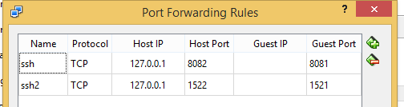

###### Running Spring Boot in Docker
## Basic Steps
1. Navigate to folder in docker tool box
2. docker build -t spring-boot-docker .
3. docker run -d -p 8082:8082 spring-boot-docker
   On windows docker run in vm. So when you do localhost:8082 you are calling localhost of host machine i.e. your windows and not docker vm that is running on different ip. 
   One way you can make localhost calls forward to vm running docker is using port forwarding.
   

4. Access the application
   
   
##References
- https://dzone.com/articles/how-to-run-spring-boot-application-in-docker
- https://spring.io/guides/gs/spring-boot-docker/

###### Running Oracle in Docker
1. Create docker login
2. Follow the steps given in https://dzone.com/articles/oracle-12c-image-installation-in-docker
   - Please note that current image location is store/oracle/database-enterprise:12.2.0.1
   
   - docker run -d -p 8080:8080 -p 1521:1521 --name OracleDB store/oracle/database-enterprise:12.2.0.1
   - docker exec -it OracleDB bash -c "source /home/oracle/.bashrc; sqlplus /nolog"
     connect sys as sysdba;
     -- Here enter the password as 'Oradoc_db1'
     alter session set "_ORACLE_SCRIPT"=true;
     create user dummy identified by dummy;
     GRANT CONNECT, RESOURCE, DBA TO dummy;
     --Now create a sample table.
     create table Docker (id int,name varchar2(20));
     --Start inserting values in to the table.
   - Service name will be ORCLCDB.localdomain  
3. To access the DB from datagrip/SQL developer set port forwarding

###### Docker Networking
- https://docs.docker.com/network/network-tutorial-standalone/
- https://docs.docker.com/engine/reference/commandline/network_create/
- https://docs.docker.com/compose/gettingstarted/