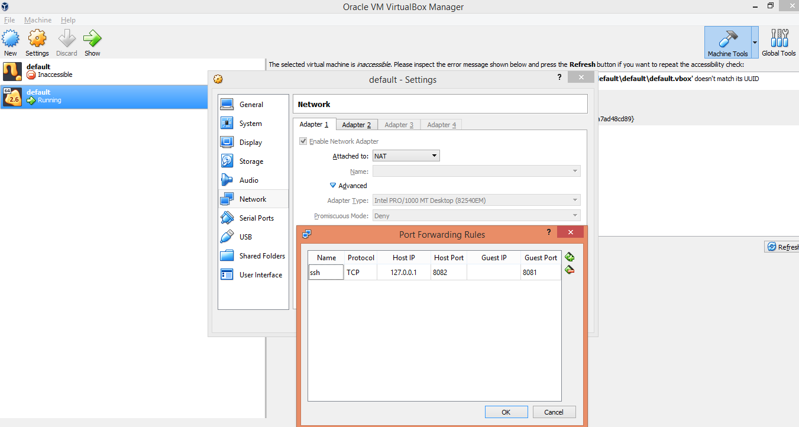
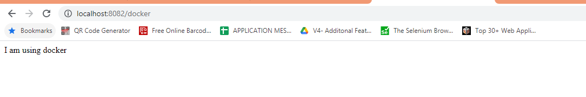

##Basic Steps
1. Navigate to folder in docker tool box
2. docker build -t spring-boot-docker .
3. docker run -d -p 8082:8082 spring-boot-docker
   On windows docker run in vm. So when you do localhost:8082 you are calling localhost of host machine i.e. your windows and not docker vm that is running on different ip. 
   One way you can make localhost calls forward to vm running docker is using port forwarding.
   

4. Access the application
   
   
##References
- https://dzone.com/articles/how-to-run-spring-boot-application-in-docker
- https://spring.io/guides/gs/spring-boot-docker/